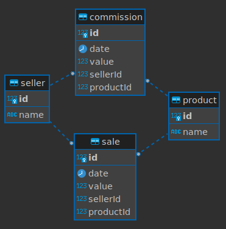

> This is a challenge by [Coodesh](https://coodesh.com/)

# Tecnologias
- Frontend: TypeScript, Next, Tailwind CSS, Jest, React Testing Library
- Backend: TypeScript, Nest, PostgreSQL, Jest

# Identificação das entidades
A figura a seguir ilustra as entidades identificadas.


# Dados exibidos no frontend
Será exibido a seguinte tabela que representa o saldo de todas as vendas somadas a comissões por produtor/afiliado.

| Seller | Total Sales | Total Commission | Balance |
| ------ | ----------- | ---------------- | ------- |
| JOSÉ   | 10000       |  5000            | 15000   |
| MARIA  | 15000       | -4000            |  9000   |

# Organização
O projeto backend segue o princípios da arquitetura hexagonal com a seguinte entrutra de diretórios.

- domain: O "domínio" da aplicação
  - entities
  - repositories
  - services
- adpter: Adaptadores
  - controllers
  - dtos
  - pipes
  - repositories
- \_\_tests\_\_: Testes unitários

No frontend
- app: App router do Next.js
- components: Componentes de uso geral
- \_\_tests\_\_: Testes unitários

# Executar o projeto
Será necessário instalar o docker e docker compose.

Na raíz do projeto executar o comando:

```bash
docker compose up
```
